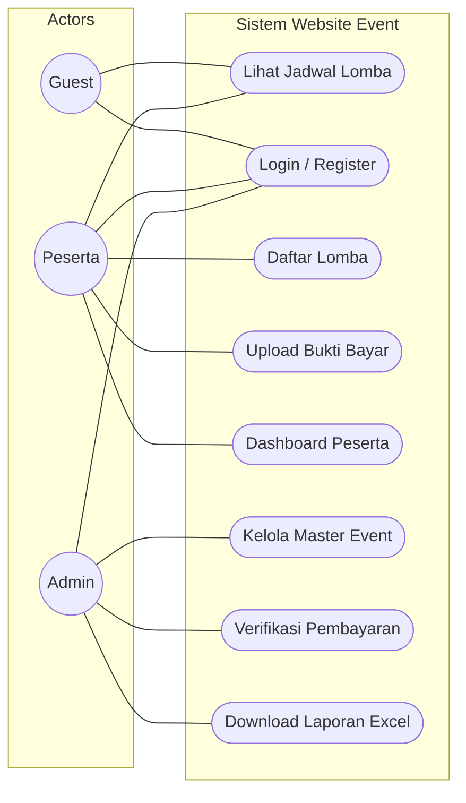

# USE CASE DIAGRAM

**Project**: Management Event Kolam Renang  
**Status**: Draft (Updated for Stability)

Siapa bisa melakukan apa? (Format Flowchart untuk kompatibilitas maksimal)

## Detail Use Case (Singkat)

1.  **Lihat Jadwal Lomba**: Semua orang bisa lihat.
2.  **Daftar Lomba**: Hanya User yang sudah login.
3.  **Verifikasi**: Hanya Admin. Peserta tidak boleh verifikasi sendiri.
