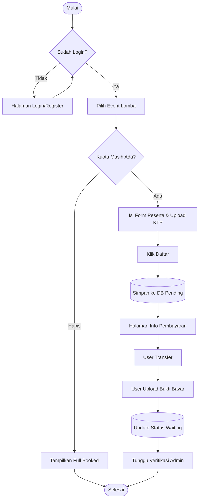
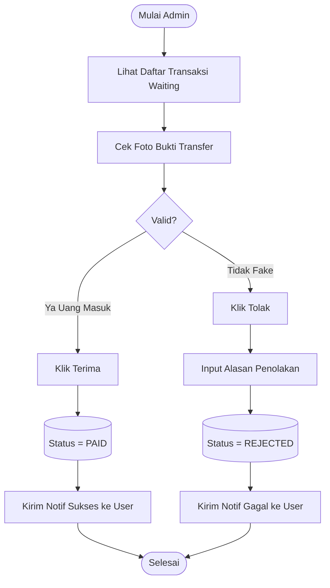

# SYSTEM FLOWCHART (Activity Diagram)

**Project**: Management Event Kolam Renang  
**Status**: Draft

Berikut adalah alur logika utama yang harus di-coding.

## 1. Flow Pendaftaran Lomba (User Side)

## 2. Flow Verifikasi Pembayaran (Admin Side)

