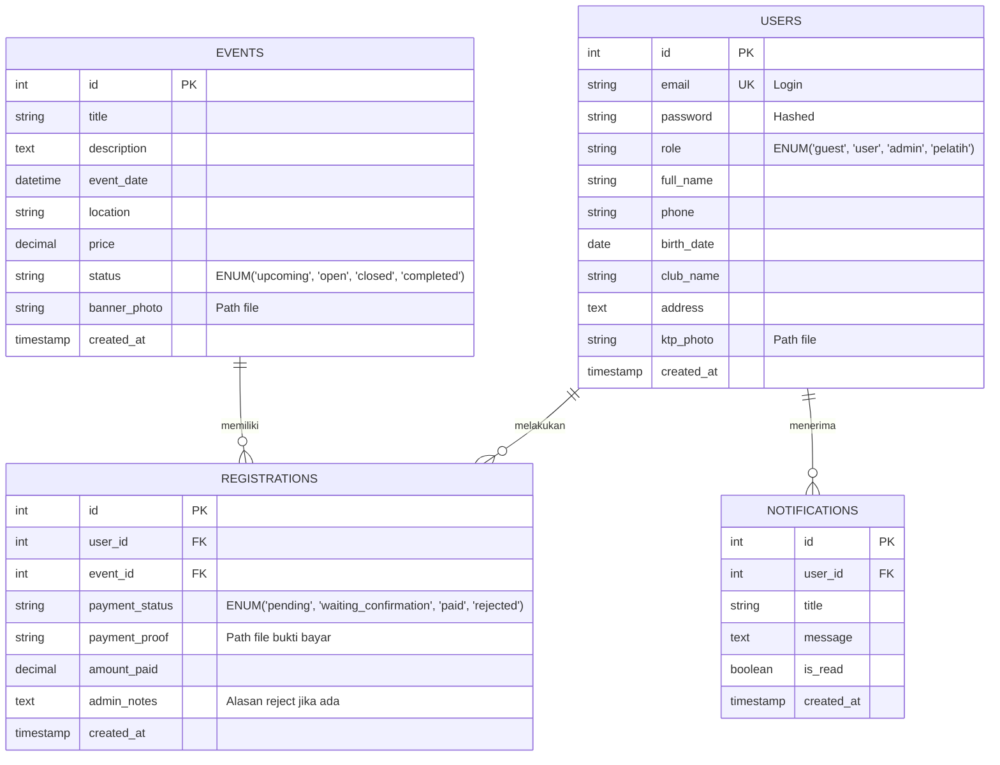

# ENTITY RELATIONSHIP DIAGRAM (ERD)

**Project**: Management Event Kolam Renang  
**Status**: DRAFT (Bahan Coding Minggu 1)

Berikut adalah struktur database yang **HARUS** diimplementasikan Junior Dev.

## Catatan Implementasi (Untuk Junior)

1.  **Users Table**: Simpan password wajib pakai `password_hash()` (Bcrypt/Argon2). Jangan Plain text!
2.  **Registrations**: Tabel ini adalah 'Transaksi'. Satu user bisa daftar banyak event.
3.  **Roles**: Simpan sebagai String/Enum di database agar mudah dibaca.
